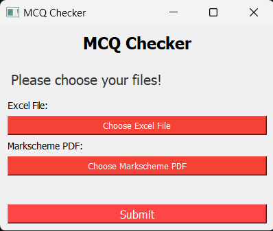
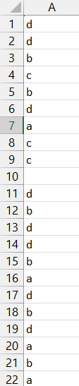

<div align="center">
  <h1>IGCSE-MCQ-checker </h1>
  <p>
    <b>A simple Python-based utility tool which can be used to check your mcq paper2 past papers.</b>
    <br/>
    <br/>
    
    
    
  </p>
</div>

This project provides a simple GUI-based utility tool which allows students of the CAIE high school curriculum (IGCSEs, O Levels) to check their past papers and not waste time on doing it manually. 


When run, the program produces a simple, elegant and intuitive GUI window, where you can then select your excel file and markscheme of the paper you want to check. The report will automatically be created and output to the directory which you have the program downloaded, the report will automatically be opened in a browser.

<div align="center">

</div>


### Download the [latest program release](https://github.com/TazeXL/IGCSE-MCQ-checker/releases/latest)!

## Usage

1. Prepare an Excel file with your answers. In the first column (column A), write your answer for the first question in cell A1, for the second question in cell A2, and so on.

   

2. If there are any questions that are no longer in the syllabus, leave the corresponding cell blank. The software will deduct one mark from the total for each blank cell.

3. Run the software and select your Excel file and the markscheme PDF when prompted.

4. The software will process the files, match the answers, and generate a report PDF with the total marks obtained and a list of incorrect answers (if any).

5. The report PDF will be saved in the project directory and automatically opened for your reference.

   
## Installation


### macOS/Linux


Open Terminal by going into `Finder -> Applications -> Utilities -> Terminal` (macOS) or by using the `CTRL + ALT + T` shortcut (Linux).

Ensure you have python installed by running:

```
python3 --version
```

If you have Python installed, this should return your local Python version. If not, you can download and install Python [here.](https://www.python.org/downloads/)

Navigate to the directory where you wish to download the software by either:
- Using the `cd /path/to/folder/` command in terminal, where `/path/to/folder` is the path to the directory.
- On macOS, navigating to the directory in Finder, then right-clicking the folder and selecting the 'New Terminal at Folder' option under 'Services'.

Download the [latest program release](https://github.com/TazeXL/IGCSE-MCQ-checker/releases/latest/) to that directory and unzip the file.

Alternatively, you may also get the program files from the source using git:
```
git clone https://github.com/TazeXL/IGCSE-MCQ-checker.git
```

Navigate into the repository folder you just created:
```
cd ./IGCSE-MCQ-checker/
```
Install dependencies using the pip process manager:
```
python3 -m pip install -r requirements.txt
```

And that's it! Hopefully, if everything went right, you should be ready to use the IGCSE-MCQ-checker!

To use the application, simply run the `main.py` file using the following command:

```
python3 main.py
```


### Windows

Open the Command Prompt by entering the Start Menu and entering `cmd`.

Ensure you have python installed by running:

```
python3 --version
```

If you have Python installed, this should return your local Python version. If you do not have Python installed, please install the latest Python version from the Microsoft Store.

Navigate to the directory where you wish to download the software by either:
- Using the `cd C:\path\to\folder\` command in Command Prompt, where `C:\path\to\folder\` is the path to the directory.
- Navigating to the directory in File Explorer, then right-clicking the folder and selecting the 'Open in Terminal' option.

Download the [latest program release](https://github.com/TazeXL/IGCSE-MCQ-checker/releases/latest/) to that directory and unzip the file.

Alternatively, you may also get the program files from the source using git:
```
git clone https://github.com/TazeXL/IGCSE-MCQ-checker.git
```

Navigate into the repository folder you just created:
```
cd .\IGCSE-MCQ-Checker\
```

Install dependencies using the pip process manager:
```
python3 -m pip install -r requirements.txt
```

And that's it! Hopefully, if everything went right, you should be ready to use the CAIE Downloader!

To use the application, simply run the `main.py` file using the following command:

```
python3 main.py
```

In the case of any bugs or issues, feel free to report them here on GitHub. Please first check if they have already been addressed over on the [Issues Tab](https://github.com/TazeXL/IGCSE-MCQ-checker/issues). If you have discovered a new issue/have an improvement suggestion, go ahead and create a new issue, and I will take a look at it as soon as possible.

Alternatively, for any questions, bug reports, issues, and so on, you can find me over on Discord (@tazexl).
